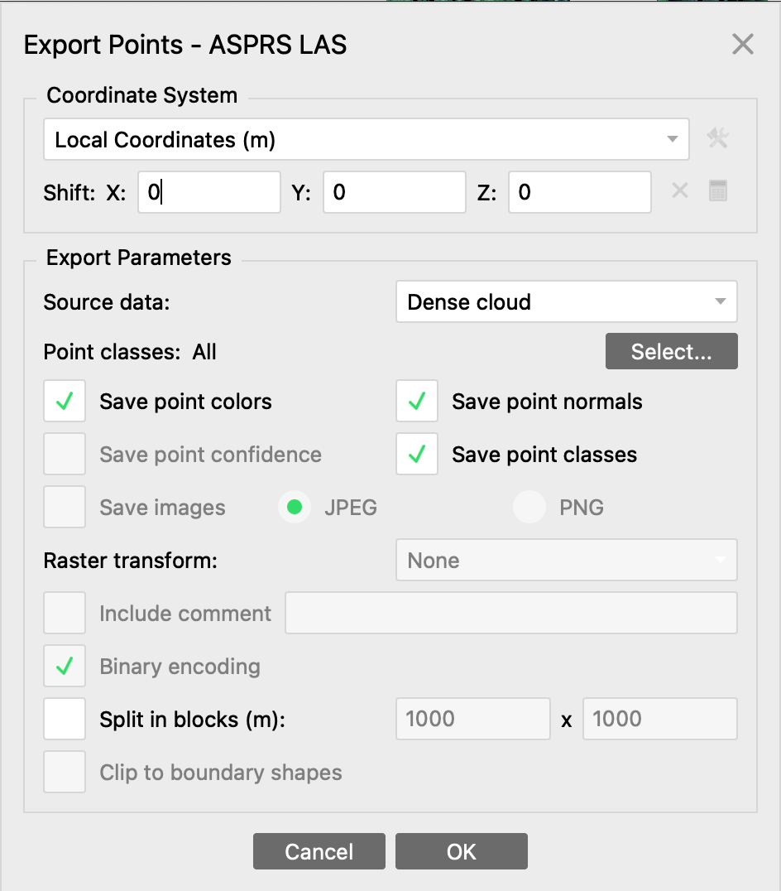
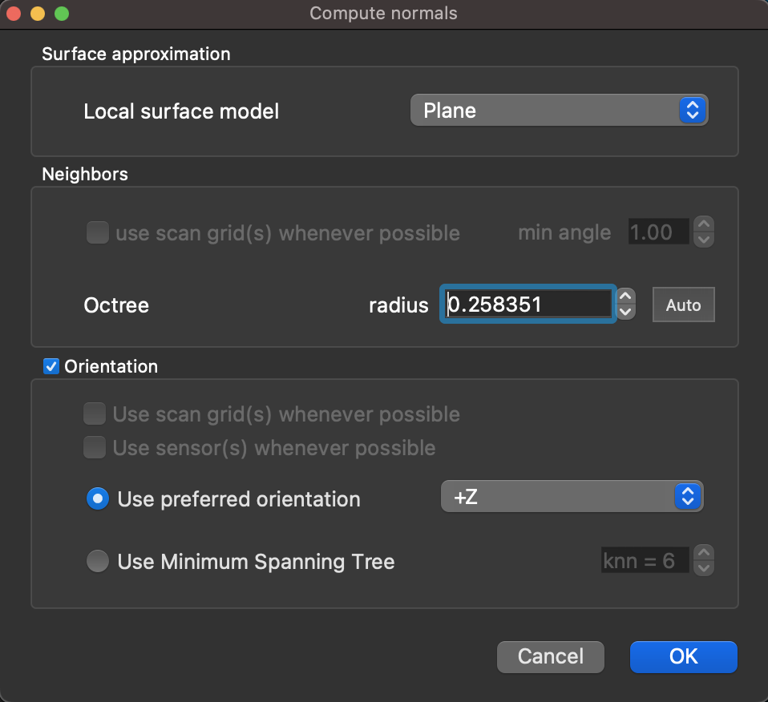
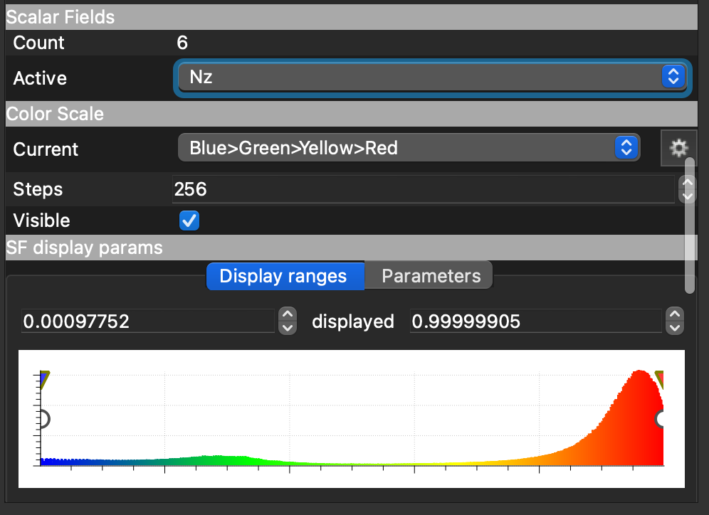

# Tutorial_Normals_Computing

This tutorial explains how to create a DEM based on a point cloud in Metashape. 

## 1. Export the Point Cloud from Metashape

In order to export the Point Cloud from metashape, right-click on the dense cloud and select export. A new window like the following image will open, it is important to change the coordinates to local like in the picture. 

**Figure 1: Export the Point Cloud**

## 2. Import the Point Cloud in Cloud Compare 

To import the las file, you can click in the menu "File", click on "open" and select the file. When the first window to appear, just click on apply but in the second window, when asking about the global shift and scale it is important to modify the shift in the x and y value to 0. 

## 3. Compute the normals 

Fisrt select the cloud, then go to the "Edit" menu, select "Normals" and "compute". You can see in the following picture the parameters I chose that worked best for my data. 

**Figure 2: Normals computing parameters**

## 4. Visualizaton 

Once calculated, to visualize it you will need to transform the normal to scalar values. You can do that by going to the "Edit" menu, select "Normals" then "Export to SF". A window will appear with the z value chosen, select "ok". 

Then go to the properties of the point cloud (bottom left window of the software), select the Nz values as the active scalar field. Like in the following picture, you can then choose the classification display you prefer and filter the values based on the color histogram of the numeric field. 

**Figure 3: Normals display**

In the histogram, the triangle markers are to vary the color classification whereas the cercle markers are to filter the point by values. By default, the filtered points are shown in grey as Nan values but you can changes the preferences in the parameters of the "SF display params".

## 5. Export the filtered point cloud

Once you are satisfied with the filtering, you can go to the "Edit" menu, select "Scalar Field" and click on filter by value. By default the input values are the ones you visualized. Click on "export" and select the optimal resolution for the tie point in the new window, then click on "ok".

## 6. Reimport your point cloud in your Metashape project 

To reimport your las file, go to "File", "Import ...", "Import Points". In the window displayed like the following picture, make sure to select local coordinates and no shift. Click on "ok" and agree when asked to replace default dense cloud. 

## 7. Create the orthomoisaic from mesh 

When applying the metashape workflow to create the orthomoisaic, you'll need to recreate the mesh based on the new filtered point cloud to create a surface model (mesh) and then create the orthomoisaic. 
